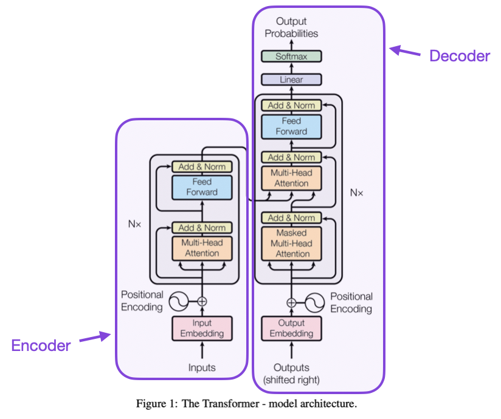

# Large Language Models Practice

## Introduction

Large language models (LLMs) have a fantastic evolution trajectory even dated back to ELIZA at 1966 [1].

Transformer (Attention is what you need) marks the starting of LLM era. 

Obviously, ChatGPT is worldside applicable. There is an important development history for the GPT training models [2]. It is easy to understand why prompting engineering is useful through the model training.

## Pre-training

## Fine-tuning

Fine-tune models are plausible for most application scenarios. 

There are practical strategies for LLM practice. 
+ Prompting engineering
+ ChatGPT application
+ Langchain

Regarding fine-tune, there are stratigies to enable the applications.
+ LoRA: Low-Rank Adaption of LLM 

## Ongoing

[CS25: Transformers United Seminar](https://web.stanford.edu/class/cs25/)  from Stanford University. Since their introduction in 2017, transformers have revolutionized Natural Language Processing (NLP). Now, transformers are finding applications all over Deep Learning, be it computer vision (CV), reinforcement learning (RL), Generative Adversarial Networks (GANs), Speech or even Biology. Among other things, transformers have enabled the creation of powerful language models like GPT-3 and were instrumental in DeepMind's recent AlphaFold2, that tackles protein folding.

1. Introduction to Transformers
Speaker: Andrej Karpathy
2. Language and Human Alignment
Speaker: Jan Leike (OpenAI)
3. Emergent Abilities and Scaling in LLMs
Speaker: Jason Wei (Google Brain)
4. Strategic Games
Speaker: Noam Brown (FAIR)
5. Robotics and Imitation Learning
Speaker: Ted Xiao (Google Brain)
6. Common Sense Reasoning
Speaker: Yejin Choi (U. Washington / Allen Institute for AI)
7. Biomedical Transformers
Speaker: Vivek Natarajan (Google Health AI)
8. In-Context Learning & Faithful Reasoning
Speakers: Stephanie Chan (DeepMind) & Antonia Creswell (DeepMind)
9. Neuroscience-Inspired Artificial Intelligence
Speakers: Trenton Bricken (Harvard/Redwood Center for Theoretical Neuroscience/Anthropic) & Will Dorrell (UCL Gatsby Computational Neuroscience Unit/Stanford)

In summary, LLM is going forward an amazing future with pre-training and fine-tuning tool sets.

### References
[1] [The brief history of Large Language Models: A Journey from ELIZA to GPT-4 and Google Bard](https://levelup.gitconnected.com/the-brief-history-of-large-language-models-a-journey-from-eliza-to-gpt-4-and-google-bard-167c614af5af)
[2] [Andrej Karpathy: State of GPT Microsoft Build 2023](https://www.youtube.com/watch?v=bZQun8Y4L2A)

